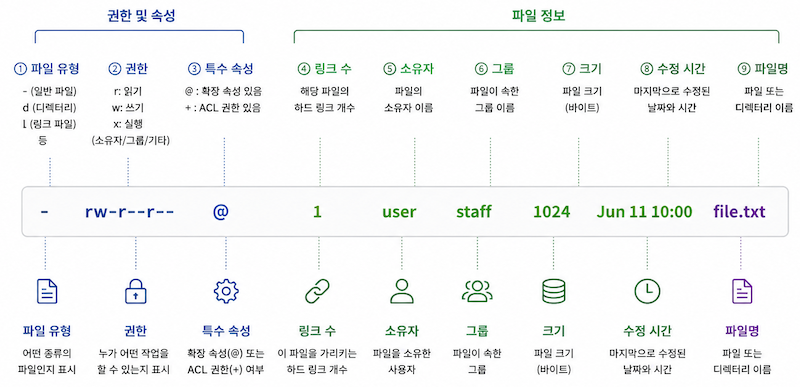

# Platform - Linux

- [디렉토리 구조](#디렉토리-구조)
- [명령어](#명령어)
  - [기본 시스템 조회/변경](#기본-시스템-조회변경)
  - [파일 조회](#파일-조회)
    - [파일명 메타캐릭터 검색](#파일명-메타캐릭터-검색)
  - [파일 처리](#파일-처리)
  - [용량/메모리 확인](#용량메모리-확인)
  - [프로세스 관리](#프로세스-관리)
  - [서비스 관리](#서비스-관리)
  - [네트워크](#네트워크)
  - [vim](#vim)
  - [기타 명령어](#기타-명령어)
  - [터미널 단축키](#터미널-단축키)
- [Ubuntu](#ubuntu)
  - [설치 (22.04.1 live server amd64 기준)](#설치-22041-live-server-amd64-기준)
- [PBL](#pbl)
  - [방화벽 및 SSH 설정](#방화벽-및-ssh-설정)
  - [LVM(Logical Volume Manager) 볼륨 사이즈 확장](#lvmlogical-volume-manager-볼륨-사이즈-확장)

---

## 디렉토리 구조

- `/bin`: 기본 명령어
- `/sbin`: 관리자 명령어
- `/etc`: 설정 파일
- `/dev`: 장치 파일
  - `/dev/null`: 바로 지워지는 휴지통
- `/proc`: 프로세스/커널 정보
- `/boot`: 부팅 파일
- `/lib`: 라이브러리
- `/usr`: 프로그램 및 라이브러리
  - `/usr/share/man`: 정식 배포 패키지(패키지 관리자(apt, yum 등)를 통해 설치된)
  - `/usr/local/share/man`: 비정식 배포 패키지(수동으로 설치한 외부 프로그램들)
- `/var`: 로그 및 가변 데이터
- `/tmp`: 임시 파일
- `/home`: 사용자 홈
- `/root`: root 홈
- `/opt`: 추가 설치 프로그램

---

## 명령어

**기술자**

- 표준 입력(stdin) - 키보드
  - 파일 기술자: `0`
- 표준 출력(stdout) - 디스플레이
  - 파일 기술자: `1`
- 표준 에러 출력(stderr) - 디스플레이
  - 파일 기술자: `2`
- 프로세스가 파일을 오픈할 때 마다 3부터 추가 됨
- `&숫자`: 파일 기술자를 참조

- `>`: 1>
- `2>`
- `&>` 또는 `>&`: 표준출력, 표준에러출력
- `>>`: 추가 입력

ex) `커맨드 > /dev/null 2>&1`: 커맨드의 표준 출력을 버리고, 에러 출력 또한 커맨드의 표준 출력이 향하는 곳으로 연결(&1가 커맨드 1의 리다이렉션인 /dev/null을 가르킴)

<br />

### 기본 시스템 조회/변경

- `cat /etc/os-release`: OS 정보 확인
- `uname`
  - `-a`: 전체 시스템 정보 출력
  - `-r`: 커널 버전 출력
  - `-m`: 머신 아키텍처만 출력
- `cat /etc/shells`: 설치된 쉘 목록 조회
- `cat /etc/hosts`: 도메인, IP 매핑 파일
- `chsh -s /bin/zsh`: 쉘 변경
- `users`: 현재 시스템에 로그인한 계정명
- `w`: `uptime` + 자세한 `who`
- `cat /etc/passwd`: 전체 사용자 확인, `/etc/shadow`는 계정 비밀번호 관련
- `id`: 현재 사용자의 UID, GID 및 소속 그룹 전체 확인
  - `-u`: UID만 출력
- `set`: 셀 변수(Local Variables) 목록
  - `-o`: 설정 목록 표시
  - ex)
    - `set -o noclobber`: 리다이렉션(>)으로 덮어씌우기 금지 옵션을 셀에 설정, 영구설정은 환경변수와 마찬가지로 설정( ~/.zshrc )파일에 작성
    - `set +o noclobber`: 위 설정을 해제
- `unset {변수명}`: 변수 삭제
- `env`: 환경변수 목록
- `man`: 명령어 매뉴얼(도움말) 출력, less의 기능을 따름
- `su -`: root사용자로 변경, `su - root` 또는 `sudo -` 와 동일
- `sudo -i`: root 쉘이 필요한 경우
- `passwd root`: root계정 패스워드 설정

top,

<br />

### 파일 조회

- `ls`: `ls -alF`
  - `-a`: 숨김 파일 모두 표시
  - `-l`: 상세 표시
  - `-F`: 파일 타입 표시
  - 
- `cat`
  - `-n`: 행번호 표시
- `more`: 페이지 단위 출력 (이전 페이지 이동 불가, 잘안씀)
- `less`: 페이지 단위 출력 및 검색
  - g: 파일 맨 처음
  - G: 파일 맨 끝
  - 검색
    - /검색어: 아래 방향 검색
    - ?검색어: 위 방향 검색
    - n: 다음 검색 결과
    - N: 이전 검색 결과
- `head -n N`: 처음 N행 출력, 기본 10행
- `tail -n N`: 마지막 N행 출력
- `tail -f`: 실시간 로그 조회
- `wc`: 줄/단어/문자 수 계산
  - `-l`: 행 수
  - `-m`: 글자 수(공백 포함)
- `grep`: 문자열 검색
  - `-n`: 행번호 표시
  - `-i`: 대소문자 무시
  - `-E`: 확장 정규식 사용
  - `-v`: 일치 항목 제외
  - ex)
    - `grep '^a.*\.$' file`: a로 시작하고 .로 끝나는 행
    - `grep '^[^#]' file`: 코멘트 #를 제외한 행
    - `grep -v '^#' file`
    - `grep '^[0-9]\{4\}.*\.$' file`
    - `grep -E '1|2' file`: 1 또는 2
- `egrep`: 확장 정규식 검색
- `file`: 파일 종류 확인

#### 파일명 메타캐릭터 검색

- `ls -l /bin/m*`: m으로 시작하는 파일들
- `ls -l /bin/m?`: m으로 시작하는 두 글자인 파일
- `ls -l [^a]*`: a로 시작하지 않는 파일들
- `rm -rf .*`: .로 시작하는 숨김파일 모두 삭제

<br />

### 파일 처리

- `tr`: 문자 치환
- `sed`: 문자열 치환
- `cut`: 특정 필드 추출
- `od`: 파일을 8진수/16진수로 출력
- `split`: 파일 분할
  - `split -l 5 file`: 5행씩 분할하여 xaa, xab, ... 생성
  - `split -b 10M bigfile part_`: 10MB씩 분할하여 part_aa, part_ab, part_ac, ... 생성
  - `split -l 1000 -d -a 3 file part_`: 1000행씩 분할하여 part_000, part_001, part_002, ... 생성
    - `-d`: 숫자 접미사
    - `-a`: 접미사 길이 지정
- `tar`: 아카이브 및 해제
  - `tar -cf arc.tar a b c`: a, b, c 파일을 arc.tar로 아카이브 생성
  - `tar -tvf arc.tar`: arc.tar내의 파일 목록 상세 표시
  - `tar -xf arc.tar`: 아카이브 해제
  - 압축 옵션
    - `-j`: bzip2(bz2)
    - `-J`: xz(.xz), 배포시 많이 사용(압축률 높음)
    - `-z`: gzip(.gz), 가장 흔함(빠름)

mkdir, rmdir, rm, mv, cp

<br />

### 용량/메모리 확인

- `swapon -s`: swap 메모리 확인
- `df -h`: Disk Free
- `du -h`: Disk Usage
  - `-s:` summary, 사용량 총 합 표시
  - `-h`: human-readable
  - ex) `du -sh *`: 현재 경로 내의 폴더, 파일의 용량 표시

<br />

### 프로세스 관리

- `ps`: 프로세스 조회
  - `ps aux | head -n 1; ps aux | grep mysql`: 다른 사용자의 프로세스도(a), 보기 좋게(u), 백그라운드 프로세스(x) - 자원 사용률 확인
  - `ps -efl`: 모든 프로세스(e), 상세 정보(f), 긴 포맷(l) - 프로세스 디버깅
  - `ps ax | cut -c 1-5`: 프로세스 아이디 표시
  - `ps -o pid,comm,nice,pri`: 유저 정의 포맷(o)
  - `ps -ef -o pri`
  - 컬럼
    - `PID`: 프로세스ID,
    - `PPID`: 부모 프로세스, 없을 경우는 0
    - `C`: 단기간 cpu 사용률
    - `TTY`: 제어하고 있는 단말
    - `PRI`: 실제 실행 우선도(작을수록 높음)
    - `NI`: 설정한 우선순위(작을수록 높음, -20 ~ 19)
    - `STAT`
      S: 잠자고 있음, 중지가능
      R: 동작중 또는 동작가능
      X: 완전히 죽음
      Z: 죽어있는 좀비
- `top`: 실시간 프로세스 모니터링
- `jobs`: 백그라운드 작업 확인
  - `ctrl + z`(포그라운드 잡 일시정지) -> `bg`(백그라운드 실행) 또는 `bg %{잡번호}` -> `fg`(포그라운드 복귀)
- `kill`: PID 종료, 시그널 생략시 15(SIGTERM)가 기본
  - `kill -l`: 시그널 목록 표시, `man signal`가 편함
  - `kill -9 20000` 또는 `kill -SIGKILL 20000`
  - `kill %3`: 잡번호 3을 종료
  - 시그널(맥에서는 SIG 생략)
    - `9`: SIGKILL : 강제 종료(커널에 의함)
    - `15`: SIGTERM : 클린업(사용한 자원 반환, 잠긴파일 삭제 등) 후 종료처리(디폴트)
- `killall`: 프로세스명으로 종료, `pkill`로 써도 됨
  - `killall -9 testapp`
- `pgrep`: 프로세스 이름으로 PID검색
  - `pgrep chrome`
- `nice`: 프로세스 우선순위(-20 ~ 19, -는 루트권한만 가능) 지정
  - `nice -n 19 bc`: bc프로세스의 NI를 19로 지정
- `renice`: 실행 중인 프로세스의 NI를 변경
  - `renice -n 19 -p 500`: PID가 500인 프로세스의 NI를 19로 변경
- `lsof`: 열린 파일 및 포트 확인
  - `lsof -i:3306`

<br />

### 서비스 관리

- `systemctl`: 서비스 관리
- `snap`: 패키지 관리

<br />

### 네트워크

- `netstat`: 네트워크 상태 확인
  - `-a`: 전체 연결 표시
  - `-n`: 숫자 형식 출력
  - `-l`: Listen 포트 표시
  - `-c`: 실시간 갱신

<br />

### vim

- command 모드: esc
  - `Ctrl + f`: 다음 페이지
  - `Ctrl + b`: 이전 페이지
  - `G`: 최종행
  - `nG`: n행으로 이동
  - `b`: 앞단어의 첫문자로 이동
  - `e`: 뒷단어의 끝문자로 이동
  - `x`: 1문자 삭제
  - `nx`: n문자 삭제
  - `dd`: 1행 삭제
  - `ndd`: n행 삭제
  - `dw`: 1단어 삭제
  - `D`: 커서부터 행의 끝까지 삭제
  - `dG`: 커서행부터 마지막행까지 삭제
  - `dH`: 화면의 1행부터 커서행까지 삭제
  - `yy`: 커서 행 복사
  - `p`: 커서 행 아래/커서 뒤 에 붙여넣기
  - `u`: 마지막 실행을 취소

- 검색 모드: /, ?
  - `/검색어`: 앞으로 검색
  - `?검색어`: 뒤로 검색
  - `n`: 다음 결과
  - `N`: 이전 결과
  - `:noh`: 검색 강조 제거(검색 자체는 유지)

- 입력모드
  - `i`: 커서 앞 입력
  - `I`: 커서 행의 젤 앞
  - `a`: 커서 뒤 입력
  - `A`: 커서 행의 젤 뒤
  - `o`: 커서 행 아래 새 행
  - `O`: 커서 행 위에 새 행

- ex 모드: 「:」
  - `w`: 저장
  - `wq`: 저장 후 종료
  - `e!`: 변경사항 파기 후 재실행
  - `ZZ`: 저장 후 종료
  - `! command`: vim을 빠져나가지 않고 command실행

- 설정: 「:set 옵션」, 「:set no옵션」
  - 항상 적용 시, `~/.vimrc` 또는 `~/.exrc`에 `set number`와 같이 추가
  - `set`: 현재 적용중인 옵션 표시
  - 옵션
    - `all`: 모든 옵션 표시
    - `number`: 행번호 표시
    - `ignorecase`: 대소문자 구별을 안함
    - `list`: 탭, 행끝 문자 등 미표시 문자를 표시

- 문자열 치환
  - `:%s/test/good/g`: 파일 전체에서 모든 test를 good으로 변경

<br />

### 기타 명령어

- `echo $(echo $HOME)`
- `!!`: 마지막으로 실행한 명령어 가져오기
- `md5sum`(128비트의 해쉬값), `sha256sum`, `sha512sum`
  - `sha256sum file1 > file.check`
  - `sha256sum file2 >> file.check`
  - `sha256sum --check file.check`: file1와 file2 동시 체크

history,

<br />

### 터미널 단축키

- `Ctrl + l`: Clear Terminal
- `Ctrl + a`: 커서를 젤 앞으로 이동
- `Ctrl + e`: 라인의 끝으로 이동
- `Ctrl + w`: 왼쪽방향으로 단어 삭제
- `Ctrl + u`: 전체삭제
- `Ctrl + k`: 커서 오른쪽 문자들 지우고 버퍼에 저장
- `Ctrl + y`: 버퍼의 문자들 붙여넣기
- `Option + 좌우`: 단어 이동
- `fn + UP-Arrow`: PageUP
- `fn + Down-Arrow`: PageDown

---

## Ubuntu

### 설치 (22.04.1 live server amd64 기준)

- [참고](https://blog.dalso.org/article/ubuntu-22-04-lts-server-install)
- [참고](https://as-you-say.tistory.com/181)

**설치 시, 주의 사항**

1. Profile setup
   - Your name: 사용자의 실제 이름 또는 관리자의 이름
     - 노출 되는 곳 없음(아마)
     - Your Pick a username과 동일히 작성
   - Your server's name: 프롬프트의 유저명@{이부분}
     - 마침표(.) 입력 불가
     - 언더바는 입력은 되지만 생략댐
   - Your Pick a username: 사용자의 시스템 로그인 아이디. 프롬프트의 {이부분}@서버명
     - 언더바 인식 됨
     - 초기 계정의 로그인 아이디
2. 추가적 설치는 불필요

**설치 후, 업데이트 및 필요 패키지 설치**

```shell
apt update
apt upgrade
apt install curl net-tools
apt-get update && apt-get install apt-file -y && apt-file update && apt-get install vim -y
```

**설치 후, 재설치 방법**

1. F2로 Bios 진입
2. 부팅 순서에서 CD를 최상위로 설정
3. 재부팅

---

## PBL

### 방화벽 및 SSH 설정

#### 방화벽 설정

- `ufw enable`: 방화벽 활성화
- `ufw status`
- `ufw disable`

#### 방화벽 SSH 설정

- `systemctl status ssh`: ssh 서비스 실행 확인
- `ss -tuln | grep ssh`: ssh 접속 포트 확인
- `ufw allow ssh`: SSH 포트(기본값은 22번) 허용

  ```text
  # 실행 후, ufw status
  Status: active

  To  Action  From
  --  ----    ----
  22/tcp  ALLOW Anywhere
  22/tcp (v6) ALLOW Anywhere (v6)
  ```

- `ufw deny ssh`: SSH 포트 거부

> [!IMPORTANT]
> **비밀번호로 ssh접속 허용**
> /etc/ssh/sshd_config에서 PasswordAuthentication yes 라인 주석 해제
>
> **root계정 ssh 접속 허용**
> /etc/ssh/sshd_config에서 PermitRootLogin yes 라인 주석 해제

#### 접속

- `ssh username@host`
- `ssh -i [pem/file/path] ubuntu@3.35.129.200`
  - `*.pem`파일의 권한은 `chmod 400` 부여
  - 서버 아이피가 동일 하며, 서버를 다시 설치 했을 경우 ~/.ssh/known_hosts 를 제거

#### 접속 IP 제한

1. `vim /etc/ssh/sshd_config`
2. 아래 내용 추가
   ```
   AllowUsers {유저명_1}@{허용IP_1} {유저명_2}@{허용IP_2}
   ```

<br />

### LVM(Logical Volume Manager) 볼륨 사이즈 확장

우분투 라이브서버 기준

**커널 디스크, 파티션 인식**

1. `lsblk`: 블록 디바이스 sda 확인
2. `df -h`: /dev/mapper/ubuntu--vg-ubuntu--lv 확인
3. 물리 디스크 추가
4. `echo 1 | sudo tee /sys/class/block/sda/device/rescan`: 디스크 재스캔
5. `lsblk`: 디스크 인식 확인
6. `parted /dev/sda`: sda가 파티션으로 나누어져 있음, 추가한 용량을 PV가 위치한 파티션 sda3(ubuntu--vg-ubuntu--lv 가 있는 파티션)에 확장
   6.1. `print`: PV가 위치한 파티션 넘버 확인

   > [!NOTE]
   > 아래 에러가 나올 시, `Fix` 후 다시 `print`
   > Warning: Not all of the space available to /dev/sda appears to be used, you can fix the GPT to use all of the space (an extra 8388608 blocks) or continue with the current setting?

   6.2. `resizepart {파티션 넘버} 100%`
   6.3. `print`: 사이즈 변경 확인
   6.4. `quit`

우분투 라이브서버는 LVM을 사용하기 때문에 pv와 lv를 확장 후 파일시스템 적용

**물리 볼륨 확장**

7. `pvs`: 기존 물리 볼륨 PSize 확인
8. `pvresize /dev/sda3`: 확장된 sda3 파티션 크기를 LVM(PV)에 반영
9. `pvs`: PSize와 추가 가능한 PFree 확인

**논리 볼륨 확장**

10. `lvs`: 기존 논리 볼륨 LSize 확인
11. `lvextend -l +100%FREE /dev/mapper/ubuntu--vg-ubuntu--lv`
12. `lvs`: 확인

**파일 시스템 적용**

13. `resize2fs /dev/mapper/ubuntu--vg-ubuntu--lv`: ext4 형식으로 포맷

**최종 확인**

14. `lsblk`
15. `df -h`

<br />

### 권한 설정

#### 도커

- `ls -l /var/run/docker.sock`\
  그룹명 확인
- `sudo usermod -aG docker [username]`\
  그룹(docker)에 유저 추가
- `grep docker /etc/group`\
  그룹(docker)에 [username]이 추가되었는지 확인
- `systemctl restart docker` 또는 `newgrp docker`
  - restart시에는 도커 컨테이너 재실행 필요
  - newgrp은 바로 적용
- 해당 유저로 재 로그인하여 확인

<br />

### **apt** vs **yum**

`apt`: Debian 및 Ubuntu에서 사용

- 아래 명령어들의 결합
  - `apt-get`: 패키지 설치, 업데이트 및 제거
  - `apt-cache`: 패키지 조회
  - `dpkg`: `.deb` 패키지를 설치, 제거, 정보 조회, 목록 확인 등을 할 수 있게 해주는 저수준 도구

`yum`: Redhat계열에서 사용

- Redhat계열 Linux
  - Red Hat Enterprise
  - Fedora
  - CentOS

<br />

### 쉘 확인

`grep root /etc/passwd`: root사용자에 대한 정보 확인\
`cat /etc/shells`: 현재 사용 가능한 쉘 확인

<br />

### background 실행 및 foreground, background 전환

- background로 실행\
  `명령어 &`: background 실행 - 끝에 `&`를 붙여줌

- background로 전환
  1. `ctrl z`: 중지 상태로 변경
  2. `jobs`
  3. `bg %[jobs의 task number]`\
     ex) `bg %2`

- foreground로 전환
  1. `jobs`
  2. `fg %[jobs의 task number]`\
     ex) `fg %1`

<br />

### 재부팅 및 종료

재부팅: `sudo reboot` 또는 `sudo shutdown -r now`\
종료: `sudo shutdown -h now` 또는 `sudo poweroff`

<br />

### 부트로더 GNU GRUB 진입 방법

1. `sudo vim /etc/default/grub`
2. 아래와 같이 해당 값을 변경
   ```
   GRUB_TIMEOUT_STYLE=menu
   GRUB_TIMEOUT=10
   ```
3. `sudo update-grub`
4. 재부팅

<br />

### **service** vs **systemctl**

최근 리눅스 버전에서는 init데몬 대신에 systemd데몬을 사용하여 프로세스를 관리

- `service`: init데몬 사용\
  사용법)
  - `service 서비스명 status`
  - `service 서비스명 start`
- `systemctl`: systemd데몬 사용
  사용법)
  - `systemctl status 서비스명`

<br />

### 서비스 등록

#### initd

#### systemd

1. 서비스 유닛 파일 생성
   - `/etc/systemd/system/myapp.service`

     ```ini
     [Unit]
     Description=My App Service
     After=network.target # 네트워크가 준비된 다음에 이 서비스를 시작

     [Service]
     WorkingDirectory=/var/services
     ExecStart=/usr/bin/node myapp/index.js
     # ExecStart=/usr/bin/java -jar myapp/myapp-0.0.1-SNAPSHOT.jar
     User=ubuntu
     SuccessExitStatus=143 # 128 + 15(SIGTERM)
     Restart=on-failure
     Environment=NODE_ENV=production

     [Install]
     WantedBy=multi-user.target # systemd의 대상, CLI 기반 시스템/서버 모드일 때 사용
     ```

2. 권한 부여
   - `sudo chmod 644 /etc/systemd/system/myapp.service`
3. 서비스 인식
   - `sudo systemctl daemon-reload`
4. 서비스 실행 및 확인
   - `sudo systemctl start myapp`
   - `sudo systemctl status myapp`
5. 서비스 자동 실행(부팅시)
   - `sudo systemctl enable myapp`
   - `sudo systemctl is-enabled myapp`

**로그 확인**

- `sudo journalctl -u {서비스명}.service -f`
  - `-u`: 서비스 지정
  - `-f`: 실시간

<br />

### 특정 (네트워크)포트 확인 및 종료

- 사용 중인 포트 확인
  ```shell
    sudo lsof -i :8081
    sudo kill -9 PID
  ```
- 네트워크 포트 확인
  ```shell
  netstat -na | grep -i 7777
  ```

<br />

### 타임존 한국표준시(KST)로 변경

1. 현재 시간 확인 (현재 타임존)
   - `date`
2. 현재 타임존 확인
   - `ls -al /etc/localtime`
3. 타임존을 한국 표준시(KST)로 변경
   - `ln -sf /usr/share/zoneinfo/Asia/Seoul /etc/localtime`
4. 변경된 타임존 확인
   - `ls -al /etc/localtime`
5. 현재 시간 확인 (현재 타임존)
   - `date`

<br />

### preflight의 OPTIONS 응답 확인

`curl -X OPTIONS -i <요청 URL>`
