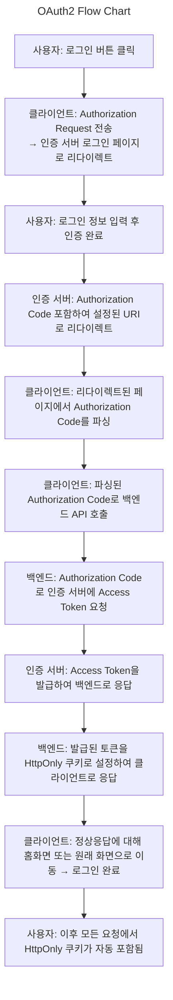

# Third Party - OAuth2

## OAuth2

대부분 OAuth2만을 사용해도 기본적인 사용자 정보를 제공하는 API가 존재함

## OIDC(OpenID Connect)

기본적인 OAuth2(인가)에 더해,
추가적으로 사용자 정보(ID, 이메일 등)를 발급하는 절차(인증)

다양한 인증 시나리오(SSO, MFA 등)를 위해 사용

- SSO: Single Sign-On
- MFA: Multi-Factor Authentication, 다중 인증
